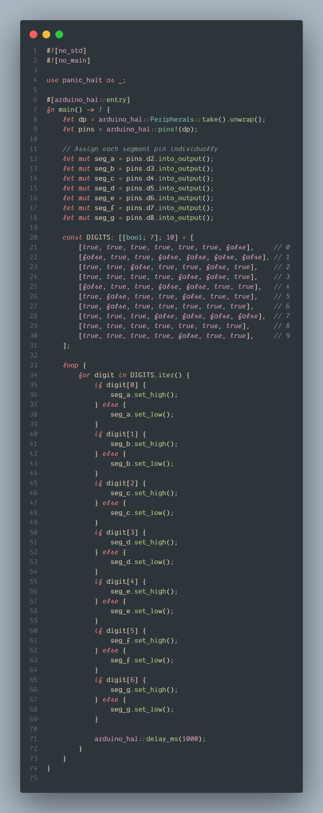

rusty-sevenseg
================
## Rust's ergonomics focus on safety, readability, and efficiency, minimizing common programming errors while maintaining high performance
Rust project for the _Arduino Uno_.

## Build Instructions
1. Install prerequisites as described in the [`avr-hal` README] (`avr-gcc`, `avr-libc`, `avrdude`, [`ravedude`]).

2. Run `cargo build` to build the firmware.

3. Run `cargo run` to flash the firmware to a connected board.  If `ravedude`
   fails to detect your board, check its documentation at
   <https://crates.io/crates/ravedude>.

4. `ravedude` will open a console session after flashing where you can interact
   with the UART console of your board.

[`avr-hal` README]: https://github.com/Rahix/avr-hal#readme
[`ravedude`]: https://crates.io/crates/ravedude

## Contribution
Unless you explicitly state otherwise, any contribution intentionally submitted
for inclusion in the work by you, as defined in the Apache-2.0 license, shall
be dual licensed as above, without any additional terms or conditions.
